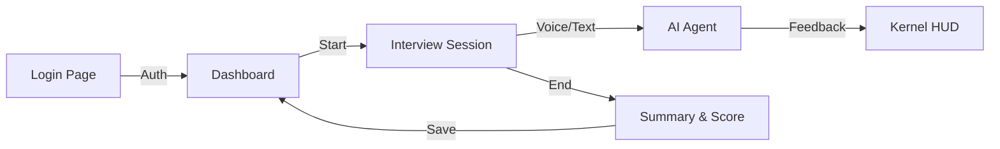
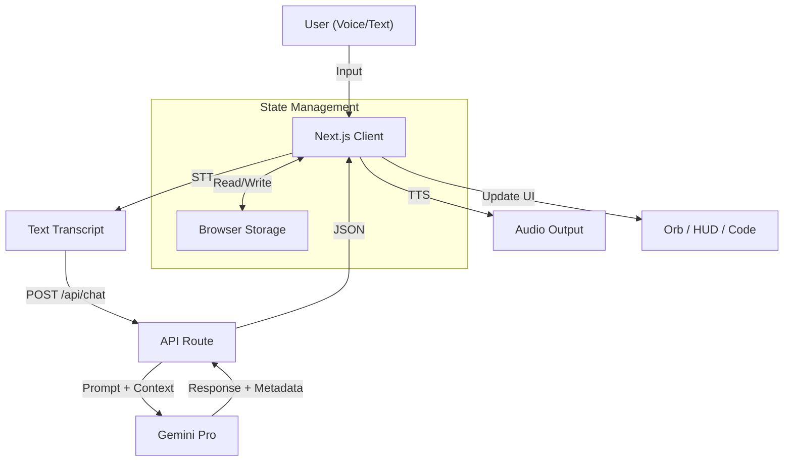
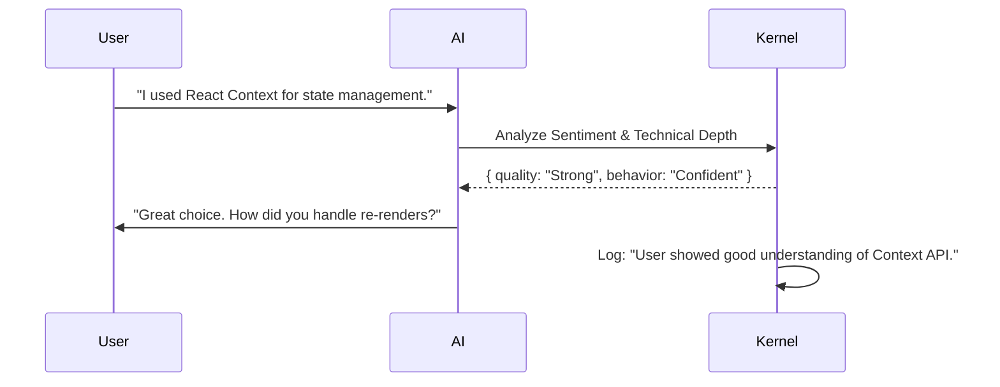

# AI Interview Agent

**AI Interview Agent** is an advanced AI-powered interview practice platform designed to simulate real-world technical interviews. It features a conversational AI agent, real-time feedback, coding workspace, and detailed performance analytics.

## 🚀 Features

*   **Immersive Interview Experience**: Real-time voice interaction with an AI interviewer.
*   **Adaptive Questioning**: The AI adapts questions based on your responses and role (e.g., Software Engineer).
*   **Coding Workspace**: Integrated code editor for technical questions with syntax highlighting and multi-language support.
*   **Real-time Feedback**: Instant feedback on your answers, including strengths and areas for improvement.
*   **Dashboard Analytics**: Track your progress with skill confidence charts, readiness trackers, and detailed session history.
*   **Memory Bank**: The AI remembers context from previous sessions to provide a personalized experience.
*   **Guardrails & Anti-Cheating**: Mechanisms to detect silence, irrelevant answers, and ensure interview integrity.
*   **Plagiarism Detection**: Monitors coding patterns and paste events to flag potential cheating.
*   **Kernel HUD**: A real-time log viewer that exposes the AI's internal reasoning, behavioral analysis (e.g., "Confident", "Chatty"), and scoring logic.

## 🧪 How to Test

1.  **Start**: Run `npm run dev` and go to `http://localhost:3000`.
2.  **Login**: Select "Pratimesh Tiwari" (Software Engineer).
3.  **Explore Dashboard**: Check out the stats, skill chart, and toggle the theme.
4.  **Interview**: Click "Start Session".
    *   Allow microphone access.
    *   Say: *"Hi, I'm Pratimesh. I have 5 years of experience in React."*
    *   Listen to the response.
5.  **Check Memory**: Click "End Session". Look at the **Memory Bank** in the dashboard—it should now list your React experience!

## 🛠️ Tech Stack

*   **Frontend**: Next.js 14 (App Router), React, Tailwind CSS, Framer Motion
*   **AI/LLM**: Google Gemini Pro (via Vercel AI SDK)
*   **Voice/Audio**: Web Speech API (STT), ElevenLabs/OpenAI (TTS), Custom Audio Visualizer
*   **State Management**: React Context / Local Storage
*   **Icons**: Lucide React

## 📦 Setup Instructions

1.  **Clone the repository:**
    ```bash
    git clone https://github.com/PratimeshTiwari/AI-Interview-Agent.git
    cd AI-Interview-Agent
    ```

2.  **Install dependencies:**
    ```bash
    npm install
    ```

3.  **Environment Variables:**
    Create a `.env.local` file in the root directory and add the following keys:
    ```env
    GEMINI_API_KEY=your_gemini_api_key
    NEXT_PUBLIC_ELEVENLABS_API_KEY=your_elevenlabs_key (Optional)
    OPENAI_API_KEY=your_openai_key (Optional for TTS fallback)
    ```

4.  **Run the development server:**
    ```bash
    npm run dev
    ```

5.  **Open the app:**
    Navigate to `http://localhost:3000` in your browser.

## 🏗️ Architecture Overview

The application follows a modern Next.js architecture with a focus on client-side interactivity for the interview session and server-side API routes for AI processing.

### Key Components

*   **`src/app/interview/page.tsx`**: The core interview session component. Handles voice input, AI response generation, state management (listening, speaking, processing), and UI rendering (Orb, Kernel HUD, Coding Workspace).
*   **`src/app/dashboard/page.tsx`**: User dashboard for analytics and history.
*   **`src/app/api/chat/route.ts`**: Main API route for handling chat interactions. Interfaces with Gemini to generate responses based on the conversation history and system prompt.
*   **`src/app/api/summary/route.ts`**: Generates a structured summary and score after the interview concludes.
*   **`src/hooks/useSpeechRecognition.ts`**: Custom hook for managing Web Speech API interactions, including silence detection.

### API Endpoints & Page Logic

*   **`/api/chat` (POST)**:
    *   **Logic**: Receives user transcript + conversation history. Uses Gemini Pro to generate a context-aware response based on the current interview phase (Intro, Discovery, Technical, etc.).
    *   **Output**: JSON containing the AI's response text, current phase, and feedback.
*   **`/api/summary` (POST)**:
    *   **Logic**: Analyzes the entire interview transcript. Scores the candidate on Technical Accuracy, Communication, and Problem Solving.
    *   **Output**: JSON with final score (0-100%), strengths, weaknesses, and a summary.
*   **`/api/helper` (POST)**:
    *   **Logic**: A lightweight endpoint for the Dashboard "AI Helper" widget. Answers quick questions about interview prep.
*   **`/interview` (Page)**:
    *   **Logic**: Manages the real-time interview state. Handles microphone input, visualizes audio, and coordinates the "User -> STT -> AI -> TTS" loop.
*   **`/dashboard` (Page)**:
    *   **Logic**: Aggregates past interview data from `localStorage`. Visualizes progress using charts and readiness trackers.

### Data Flow & User Journey

#### 1. User Journey


#### 2. System Data Flow


#### 3. Behavioral Analysis (Kernel HUD)
The **Kernel HUD** provides transparency into the AI's thought process. It logs every interaction with:
*   **Timestamp**: When the event occurred.
*   **Phase**: Current interview stage (e.g., "Technical Deep Dive").
*   **Reasoning**: Why the AI asked a specific question or gave a certain score.
*   **Behavioral Tags**:
    *   `Confident`: Clear, concise answers.
    *   `Chatty`: Excessive or irrelevant talking.
    *   `Nervous`: Frequent pauses or fillers (detected via silence/stutter).
    *   `Strong/Weak`: Quality of the technical answer.



## 🧠 System Design

### AI System Prompts
The core of the **AI Interview Agent's** intelligence lies in its carefully crafted system prompts. The AI acts as a "Senior Technical Interviewer" at a top-tier tech company.
*   **Tone**: Professional, encouraging, yet rigorous.
*   **Goal**: Assess the candidate's technical depth, problem-solving skills, and communication.
*   **Phases**:
    1.  **Introduction**: Ice-breaking and role confirmation.
    2.  **Discovery**: Experience walkthrough and project deep dives.
    3.  **Technical Deep Dive**: Core technical concepts (e.g., React lifecycle, Database indexing).
    4.  **Coding Challenge**: A practical coding problem (if applicable).
    5.  **Conclusion**: Wrap-up and candidate questions.

### System Prompt Structure
```text
You are an expert technical interviewer for the role of {role}.
Your goal is to assess the candidate's skills in {skills}.

GUIDELINES:
- Ask one question at a time.
- Be concise (max 2-3 sentences).
- Dig deeper if the answer is vague.
- Move to the next topic if the candidate demonstrates mastery.
- Maintain a professional but friendly tone.

PHASES:
[...detailed phase descriptions...]
```

### Guardrails & Integrity
To ensure a fair and effective interview, the system implements several guardrails:
1.  **Silence Detection**: The `useSpeechRecognition` hook monitors audio input. If silence persists for >5 seconds, the system prompts the user or auto-submits.
2.  **Irrelevance Detection**: The AI evaluates the semantic relevance of the user's response. If the score is low, it redirects: *"That's interesting, but could you clarify how it relates to [Topic]?"*
3.  **Anti-Cheating**: The coding workspace monitors typing speed and paste events.
4.  **Plagiarism Detection**: The system flags large blocks of code pasted instantly or solutions that match known patterns too closely.

## 📊 Scoring System

The scoring logic is multi-dimensional, evaluating the candidate on:
1.  **Technical Accuracy (40%)**: Correctness of facts and code.
2.  **Communication (30%)**: Clarity, structure, and conciseness.
3.  **Problem Solving (30%)**: Approach to unknown problems and debugging.

### Scoring Rubric
The `/api/summary` endpoint uses a specific rubric to generate the final score (0-100%):

*   **0-30% (Fail)**: No answer, "I don't know", or significant factual errors.
*   **31-60% (Needs Improvement)**: Vague answers, correct concepts but poor explanation.
*   **61-85% (Pass)**: Clear, accurate answers with good examples.
*   **86-100% (Strong Hire)**: Deep technical insight (trade-offs, internals), exceptional communication, and optimized code.

## 🎨 Design Decisions

*   **Dark Mode First**: A sleek, dark-themed UI (Cyberpunk/Sci-Fi aesthetic) was chosen to reduce eye strain and create an immersive "hacker" vibe.
*   **Client-Side Logic**: Heavy reliance on client-side state for the interview session to ensure low latency for voice interactions and UI updates.
*   **Fallback Mechanisms**: Implemented fallbacks for TTS (ElevenLabs -> OpenAI -> Browser) to ensure reliability.
*   **Modular Components**: UI elements like `AIOrb`, `KernelHUD`, and `CodingWorkspace` are separated for maintainability.


